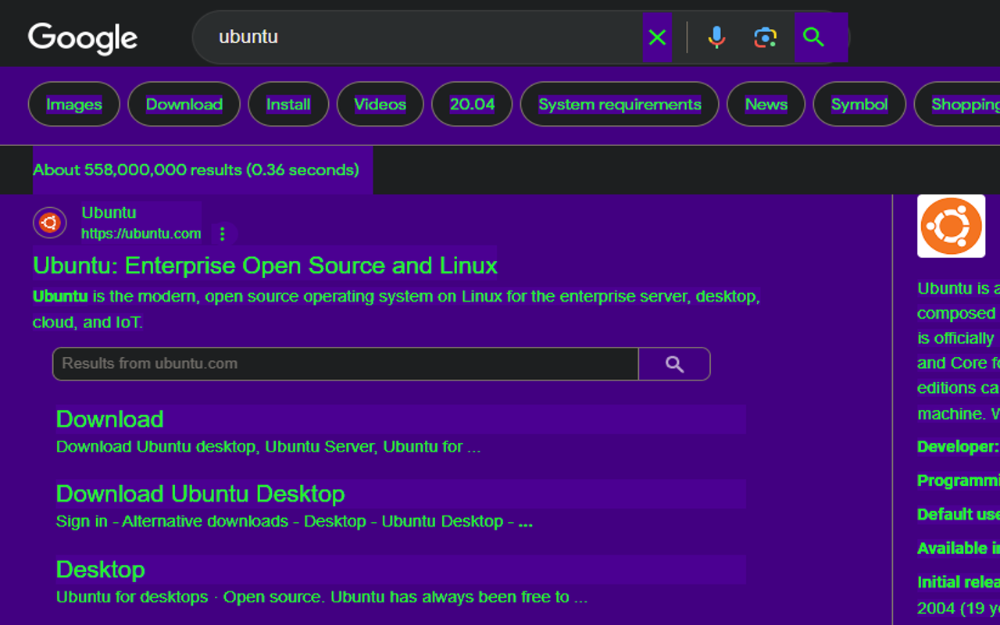
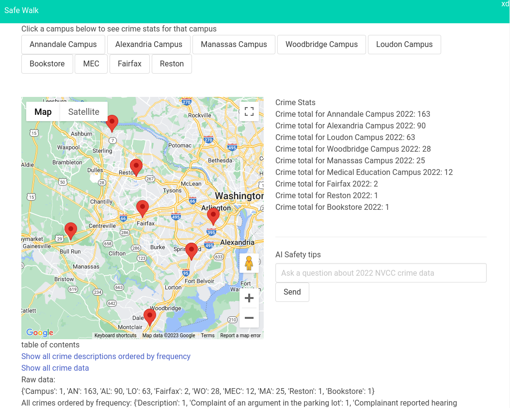

### My name is Jeffrey. I am a Full Stack Developer and Sysadmin. I am always looking to deepen my knowledge and learn more

# My Stack

<!--&nbsp;

-->

# My favorite projects i've built recently

## Colorblind Colors Chrome Extension

### This project was released on the chrome store! 🎉

### <https://chromewebstore.google.com/detail/contrast-colors-schemes-f/kmhdplcfiijnmcikebddnebmcnlnbfap?pli=1>

### This project provides high contrast colors on all website for colorblind people with 8 color schemes

### <https://github.com/JeffreyDinackus/Colorblind_Colors_Chrome_Extension>

## DateEscape

### Need to escape a commitment or date? This project allows you to use Twilio API like a pro to send text messages and calls to yourself to escape a commitment. Highly configurable, cheap, and accessible anywhere via AWS EC2

### <https://github.com/JeffreyDinackus/DateEscape>

## Safe Walk

### This was a project for Patriot Hacks 2023

### The premise was that we wanted to provide accurate crime statistics for students at our college by scraping the colleges crime DB

### I scraped my colleges DB, turned it into JSON, did some basic analytics in python and stuck it in a flask app. Then I built the HTML and passed the varaibles to the front end which was styled with bulma. I also added chatpt integration and a google maps custom made with all of the campuses

### My teammate created some graphs with matplotlib for each campuses statistics

### All in 24 hours

### <https://github.com/JeffreyDinackus/SafeWalk>

## Linux Quotes

### This project puts a quote or a joke into your terminal every time you open it up with API

### <https://github.com/JeffreyDinackus/Quote-Of-The-Day>

## Easy Asset Allocation Calc

### A simple utility for calculating your asset allocation knowing only the dollar value of your assets for any number or type of asset. Export feature included

### <https://github.com/JeffreyDinackus/Easy-Asset-Allocation-Calc>

## My website

### 
https://JeffreyDinackus.com

### 
This is the old Jeffrey Dinackus.com with the online calculators

### 
https://Freedom.JeffreyDinackus.com

## LinkedIn

### 
If I am lucky enough to be considered for a opportunity you have to offer, please contact me on LinkedIn.

### 

  

## Blogs on Dev.to

### I sometimes post blogs here

### 

## Other Websites I've built

### 
www.TCQCpatches.com

<!--
**JeffreyDinackus/JeffreyDinackus** is a ✨ _special_ ✨ repository because its `README.md` (this file) appears on your GitHub profile.

Here are some ideas to get you started:

- 🔭 I’m currently working on ...
- 🌱 I’m currently learning ...
- 👯 I’m looking to collaborate on ...
- 🤔 I’m looking for help with ...
- 💬 Ask me about ...
- 📫 How to reach me: ...
- 😄 Pronouns: ...
- ⚡ Fun fact: ...
-->
